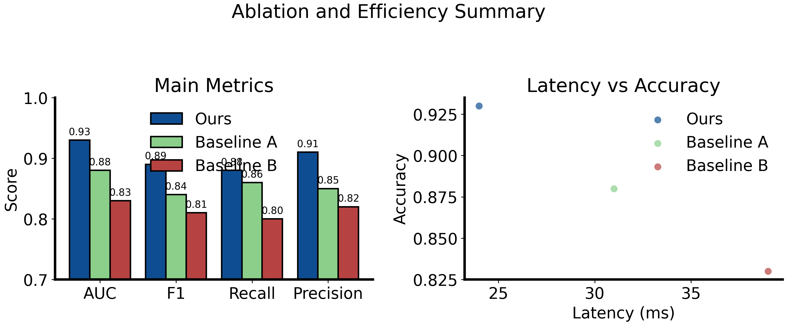

# Figure Brief: Benchmark Plot

## Output

## Figure Goal

Show a deterministic exact plot combining metric comparison bars and latency-vs-accuracy scatter points.

## Mode

`plot`

## Plot Request

See `../benchmark-plot-request.json`.

## Verification Checklist

- Bar heights match the JSON values.
- Scatter points use exact x/y coordinates.
- The plot was rendered locally instead of generated by an image model.
